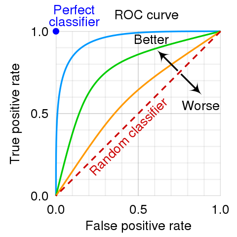
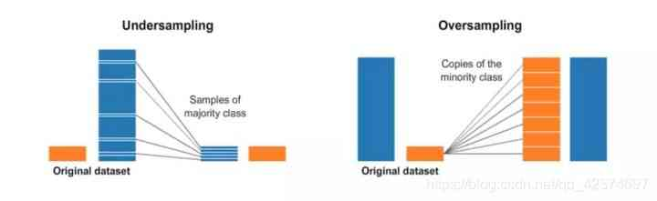
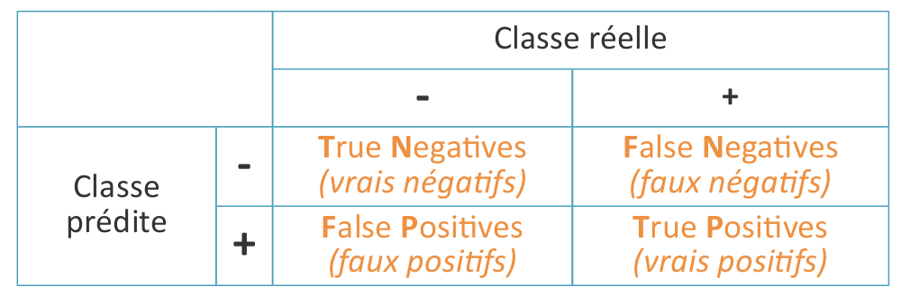
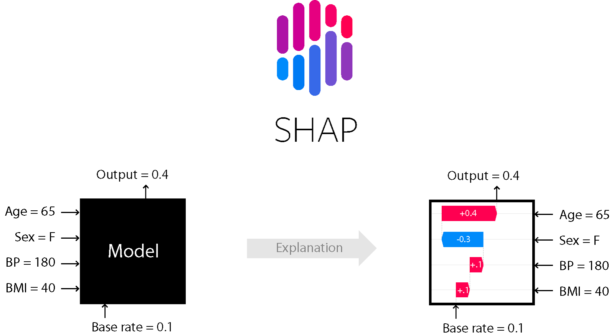
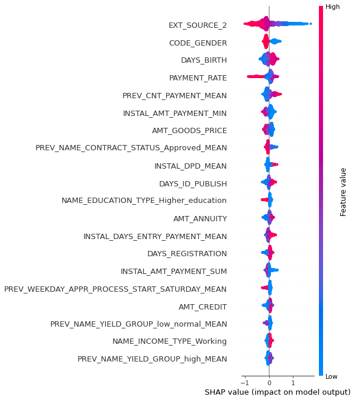
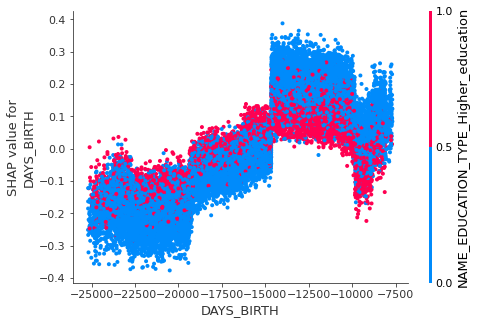

# OPENCLASSROOMS - Data Scientist

## Projet 7 - Note Méthodologique

### Contexte

```
"Prêt à dépenser" est une société financière qui propose des crédits à la consommation pour des personnes ayant peu ou pas du tout d'historique de prêt.

L’entreprise souhaite mettre en œuvre un outil de "scoring crédit" pour calculer la probabilité qu’un client rembourse son crédit, puis classifie la demande en crédit accordé ou refusé à l'aide d'un algorithme de classification.

Enfin développer un dashboard interactif pour que les chargés de relation client puissent expliquer les décisions d’octroi de crédit ainsi que de permettre à leurs clients consulter leurs informations.
```

### Présentation du travail de Data Scientist

En termes généraux, la data science est l’extraction de connaissance d’ensembles de données.

La data science est un domaine interdisciplinaire qui utilise des méthodes, des processus, des algorithmes et des systèmes scientifiques pour extraire des connaissances et des idées de nombreuses données structurelles et non structurées. Elle est souvent associée aux données massives et à l'analyse des données.

Elle utilise des techniques et des théories tirées de nombreux domaines dans le contexte des mathématiques, des statistiques, de l'informatique, de la théorie et des technologies de l'information.

Le premier objectif du data scientist est de produire des méthodes de tri et d’analyse de données de masse et de sources plus ou moins complexes ou disjointes de données, afin d’en extraire des informations utiles ou potentiellement utiles.

Pour cela, le data scientist exerce ses activités selon 4 étapes :

- La fouille de données,
- Le nettoyage/formatage des données (data wrangling)
- Le traitement des données
  - Traitements classiques (fonctions mathématiques)
  - Traitements d'apprentissage automatique
  - Visualisation de données
- L'exploitation des résultats
  - Tableaux de bords et outils d'aides à la décisions (pouvant être notamment intégrés sur des sites web)
  - Publications de résultats de recherche (interne à l'entreprise, ou publics)

### Pré-traitement des données

Chargement des données depuis la source Kagle :
https://www.kaggle.com/c/home-credit-default-risk/data

Le jeu de données est organisé comme suit :


Le nettoyage des données consiste à normaliser ou même corriger les valeurs et supprimer les valeurs aberrantes.
Il y a également une phase de raffinement des donnée qui consiste à calculer de nouvelles variables à partir de celles déjà existantes.

Après le nettoyage des données, une des plus importantes étapes est celle de l'encodage des données non numériques.
Les principales techniques d'encodage que nous utilisons sont :
- le one-hot (ou dummy) encoding, qui consiste à créer une variable par classe et attribuer 0 ou 1,
- le label encoding, qui consiste à créer un nombre unique par classe

Enfin il y a une phase d'agrégation par 'ID' qui permet de rassembler toutes les données des tables en un seul jeu de données exploitable.

Pour avoir la matrice de donnée la plus pleine possible, nous ne gardons que les variables les plus remplis (> 90%).

### Méthodologie d'entraînement du modèle

Le jeux de données est très déséquilibré (9% de classes positives). La classe 0 indique que le client a totalement remboursé son prêt, tandis que la classe 1 indique que le client a remboursé son prêt en totalité  ou en partie. Nous sélectionnerons donc des modèles capables de gérer les classes déséquilibrées comme RandomForest, XGBoost et LightGBM.

Après un test avec les paramètres par défaut, nous utilisons GridSearchCV pour rechercher les paramètres optimales du modèle ainsi qu'une Cross-Validation avec 5 folds. Pour la création des folds nous utiliserons un stratified split plutôt qu'un split aléatoire, cela permet de préserver le pourcentage d'échantillon par classe.

Nous pouvons représenter les évolutions de la sensibilité et de la spécificité en fonction du seuil de classification avec une courbe ROC. Une courbe ROC caractérise le classifieur qui a produit les résultats sous forme de probabilités par variation du seuil de classification. Un modèle idéal à une sensibilité et une spécificité de 1.
Nous pouvons donc facilement évaluer un classifier en essayant de maximiser l'air en dessous de la courbe ROC.



Tous les modèles choisi possèdent un algorithme interne de gestion du déséquilibre de classe. Ce paramètre est souvent nommé class_weight ou tout simplement is_unbalanced. Nous avons donc testé chaque modèle, à la fois avec et sans gestion du déséquilibre de classe.

Nous avons sélectionné LightGBM pour ces bonnes performances mais également pour sa prise en compte des valeurs NAN ce qui ne nous oblige pas à les compléter à grand renfort de moyenne, médiane ou même d'algorithmes plus complexes.

Nous avons testé également d'autres moyens de gérer le déséquilibre de classe avec la librairie SMOTE qui permet de faire de oversampling, undersampling ou même les deux à la fois.



L'oversampling permet de dupliquer aléatoirement de échantillon de la classe minoritaire et de l'ajouter au jeu de teste. Cela permet de passer d'un problème déséquilibré à un problème équilibré et donc mieux adapté à la plupart des algorithmes. Il y a cependant une subtilité qu'il faut prendre en compte, il est impératif de faire l'oversampling après sur chaque folds et non sur le jeux de donnée entier.

L'undersampling et plus facile à appréhender. En effet, il s'agit simplement de réduire aléatoirement le nombre d'échantillon de la classe majoritaire afin de retrouver un problème équilibré.

Il existe une dernière technique qui consiste a utiliser ces deux méthodes ensemble dans un pipeline. c'est à dire faire un undersampling partiel du jeu de donnée puis de faire un oversampling sur chaque folds. Cela permet de garder le maximum de données et de diminuer les risques de surapprentissage.

### Optimisation du modèle

Voici pour rappel la matrice de confusion :



- TN : True Negatif, le modèle prédit 0 et la valeur réelle est 0
- TP : True Positif, le modèle prédit 1 et la valeur réelle est bien de 1
- FN : False Negatif, le modèle prédit 0 alors que la valeur réelle est bien de 0
- FP : False Positif,  le modèle prédit 1 alors que la valeur réelle est de 0

L'optimisation consiste à diminuer le nombre de faux négatifs qui dans le cas bancaire est plus grave qu'un faux positif. La fonction d'optimisation doit donc déterminer le meilleur seuil de classification pour minimiser les faux négatifs.

Nous avons utilisé plusieurs métriques d'optimisation du seuil de classification de sorte à minimiser les faux négatifs :
- Une simple fonction de scoring en pondérant les faux négatifs par rapport aux faux positifs,
- Utiliser le G-mean score qui est la moyenne géométrique entre la sensitivity et la spécificity,
- Utiliser le F-beta score qui est, la moyenne harmonique pondéré de la précision et de la sensitivity.

Le modèle retourne un score entre 0 et 1 et par défaut il attribue la classe 1 lorsque le score est supérieur à 0.5 et 0 sinon. Il a été décidé d’optimiser ce seuil qui permet de définir si un client est solvable ou non.

Le G-mean score semble un bon compromis car il permet à la fois de maximiser la sensitivity et la spécificity ce qui permet de minimiser les faux négatifs et les faux positifs.

une fois le seuil optimal déterminé, nous allons choisir un score humainement compréhensible. Nous construirons donc une score client de 0 à 100 dont la moyenne 50 correspond au seuil optimal de classification. Plus précisément, de 0 à 49 la classe sera 1 et de 50 à 100 la classe sera 0.

### Interprétabilité du modèle

L'interprétation d'un modèle dépend entre autre de sa complexité. En effet, plus il est complexe plus les interprétation peuvent être nombreuses et donc biaisées.

Nous utilisons donc une librairie capable de nous aider dans cette interprétation comme SHAP (ou LIME).



SHAP (SHapley Additive exPlanations) utilise la théorie des jeux. Pour un individu donné, la valeur de Shapley d’une variable (ou de plusieurs variables) est sa contribution à la différence entre la valeur prédite par le modèle et la moyenne des prédictions de tous les individus.

Pour ce faire :
1. Calcul des valeurs de Shapley pour un individu en particulier : simuler différentes combinaisons de valeurs pour les variables d’entrée
2. Pour chaque combinaison, calculer la différence entre la valeur prédite et la moyenne des prédictions. La valeur de Shapley d’une variable correspond alors à la moyenne de la contribution de sa valeur en fonction des différentes combinaisons.

Si nous faisons une analyse de notre modèle, cela donne un horizontal bar chart d'explication de nos features :



Par ce graphique nous pouvons facilement avoir beaucoup d'informations sur la répartition des valeurs, leur contribution et son poids dans la note global

pour une interprétation plus locale nous pouvons analyser plus précisément une variable.



Ici nous pouvons voir l'explication de la variable date de naissance par rapport à la valeur de SHAP.

### Fonction cout métier et score bancaire

Le modèle retourne pour chaque échantillon une probabilité de prédiction entre 0 et 1.
Tout d'abord nous utiliserons le seuil optimal pour déterminer si le client aura ou n'aura pas des incident de paiement.
Pour avoir un score humainement compréhensible, nous avons créé un score de 0 à 100 qui correspond à la probabilité de prédiction et donc le seuil optimal correspond à la note moyenne 50.

Donc si nous prenons des probabilités de prédiction de la classe positive, avec un seuil optimal à 0.3, cela donnera :
- Pour une probabilité à 0.0, cela donnera une note de 100
- Pour une probabilité à 0.3, cela donnera une note de 50
- pour une probabilité à 1.0, cela donnera une notre de 0

### Limites et les améliorations possibles

#### Sélection des variables

Nous avons testé le modèle avec toutes les variables du modèle puis nous avons testé avec les variables les plus importantes. Cela permet d'éliminer certain problème de surapprentissage du modèle et donc d'obtenir potentiellement un meilleur score. Ici, le fait de réduire le nombre de variables a pour conséquence de réduire la performance du modèle.

#### Traitement des valeurs manquantes

Il sera également possible de mieux traiter les valeur manquantes en essayant de les prédire ou de les remplir. Cela pourrait sensiblement améliorer les performances des modèles.

#### Performance

Le jeux de donné étant relativement important, il a été nécessaire de réduire cette taille pour entrainer les différent modèle.
Ainsi nous avons fait tous nos tests avec seulement 10% des données. Cela change évidemment un peu le score de chaque modèle cependant ils garde la même performance les uns par rapport aux autres.
